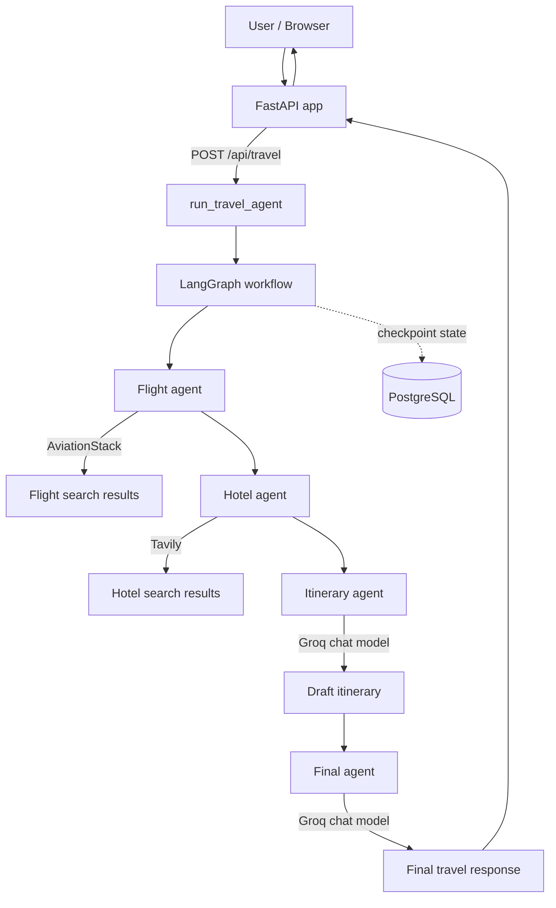

# TripMate AI

TripMate AI is a web-based travel planner that combines flight data, hotel search results, and an AI-generated itinerary in response to a natural-language trip request. It is built with FastAPI and a sequential LangGraph workflow.


## VERCEL LINK:- https://trip-mate-ai-planner.vercel.app/

## Features

- Accepts natural-language travel requests with destination, duration, origin, and budget details.
- Looks up live flight information through AviationStack, resolving common city and country names to airport codes.
- Searches the web for hotel suggestions through Tavily.
- Uses a Groq-hosted chat model to draft an itinerary and a formatted final answer using the gathered results.
- Passes flight and hotel information into itinerary generation, with budget-aware instructions in the LLM prompt.
- Uses LangGraph PostgreSQL checkpointing and a thread ID for persisted workflow state.
- Includes a FastAPI backend and a browser frontend with quick prompts, Markdown rendering, copy, and PDF download controls.

Flight and hotel results are research inputs; the application does not book travel.

## Architecture



- **FastAPI (`app.py`)** serves the Jinja2 page, static assets, the travel endpoint, and a health endpoint.
- **Backend (`backend.py`)** configures the model and builds the LangGraph state and nodes.
- **Flight tool (`tools/flight_tool.py`)** parses likely routes, maps locations to IATA codes, and requests flight data.
- **Hotel tool (`tools/tavily_tool.py`)** searches Tavily and formats a small set of web results.
- **Frontend (`templates/`, `static/`)** submits requests, shows the final answer, and offers copy/PDF actions.

## Tech Stack

| Technology | Use in this project |
|---|---|
| Python | Application and integration code |
| FastAPI | HTTP API and page serving |
| LangGraph | Sequential agent workflow and checkpoint integration |
| LangChain | Model and message abstractions used by the workflow |
| Groq (`langchain-groq`) | Hosted chat model (`openai/gpt-oss-120b`) |
| Tavily (`tavily-python`) | Hotel web search |
| AviationStack | Flight data API |
| PostgreSQL | LangGraph checkpoint persistence |
| Psycopg | PostgreSQL connection |
| Uvicorn | Local ASGI server |
| Jinja2 | HTML template rendering |
| Pydantic | Request body model |
| HTML, CSS, JavaScript | Browser interface |

## Project Structure

```text
Trip mate AI/
├── app.py
├── backend.py
├── requirements.txt
├── test.py
├── tools/
│   ├── __init__.py
│   ├── flight_tool.py
│   └── tavily_tool.py
├── templates/
│   └── index.html
└── static/
    ├── script.js
    └── style.css
```

Local environment files such as `.env`, the virtual environment, and Python cache directories are not part of the application source structure shown above.

## How It Works

1. The user enters a trip request in the browser. The frontend sends its text and the current `thread_id` to `POST /api/travel`.
2. FastAPI trims and validates the message, then calls `run_travel_agent`.
3. LangGraph starts at `flight_agent`, which searches AviationStack using route details parsed from the request.
4. `hotel_agent` searches Tavily for hotel information related to the request.
5. `itinerary_agent` sends the original request and both sets of search results to the Groq model to draft an itinerary.
6. `final_agent` asks the model to combine the request, search results, and itinerary into a formatted answer.
7. The backend returns the answer and supporting fields; the frontend displays the answer and stores the returned thread ID in browser local storage.

The graph runs these four agents in sequence. Flight and hotel lookup are tool/API calls; the two itinerary and final-answer stages invoke the LLM.

## API Keys and Environment Variables

**ALL API KEYS USED BY THIS PROJECT ARE FREE / HAVE FREE-TIER ACCESS FOR DEVELOPMENT AND TESTING.**

**IMPORTANT: The PostgreSQL database currently used for this project is temporary and its availability is expected to end on 6 November 2026 (06/11/2026). Replace it with a new PostgreSQL database before that date if continued deployment is required.**

Create a `.env` file in the project root with placeholders replaced by your own credentials:

```dotenv
GROQ_API_KEY=your_groq_api_key
TAVILY_API_KEY=your_tavily_api_key
AVIATIONSSTACK_API_KEY=your_aviationstack_api_key
DATABASE_URL=your_postgresql_database_url
DEFAULT_ORIGIN_IATA=MUM
```

| Variable | Purpose |
|---|---|
| `GROQ_API_KEY` | Required to initialize the Groq chat model. |
| `TAVILY_API_KEY` | Used by the hotel web-search tool. |
| `AVIATIONSSTACK_API_KEY` | Used by the flight search tool. This spelling matches the variable read in `tools/flight_tool.py`. |
| `DATABASE_URL` | PostgreSQL connection string used by Psycopg and the LangGraph checkpointer. |
| `DEFAULT_ORIGIN_IATA` | Optional default origin airport code when a query contains a destination but no origin; defaults to `MUM` in the code. |

The code currently has a database connection fallback if `DATABASE_URL` is missing. Set your own `DATABASE_URL` and remove that embedded fallback from `backend.py` before publishing or deploying the project. Do not copy database credentials into documentation or source control.

## Installation (Windows PowerShell)

1. Clone the repository. Replace the placeholder with the repository's actual clone URL:

   ```powershell
   git clone <repository-url>
   cd "Trip mate AI"
   ```

2. Create and activate a virtual environment:

   ```powershell
   python -m venv venv
   .\venv\Scripts\Activate.ps1
   ```

   If PowerShell blocks activation, use the activation method permitted by your system's execution policy, or run the environment's Python directly as `venv\Scripts\python.exe`.

3. Install the pinned dependencies:

   ```powershell
   python -m pip install --upgrade pip
   pip install -r requirements.txt
   ```

4. Create `.env` in the project root and add the API keys and PostgreSQL URL shown above. The application needs valid service credentials and a reachable PostgreSQL database to run the full workflow.

## Running the Application

From the project root, with the virtual environment activated and `.env` configured:

```powershell
python app.py
```

The development server binds to `127.0.0.1:8000`:

- Web interface: <http://127.0.0.1:8000>
- Health check: <http://127.0.0.1:8000/health>

The health endpoint reports that the API process is running; it does not verify external API or database availability.

## Testing

The repository includes an interactive script that runs a travel request through the backend:

```powershell
python test.py
```

Enter a query when prompted, for example:

```text
plan a 7 days trip to japan from india within 2 lakhs
```

The script uses the fixed thread ID `test_user` and prints the final answer. It makes live service calls and therefore requires the configured API credentials and PostgreSQL connection.

## API Endpoints

| Method | Path | Behavior |
|---|---|---|
| `GET` | `/` | Renders the travel planner page. |
| `POST` | `/api/travel` | Runs the travel-planning workflow. |
| `GET` | `/health` | Returns a basic API process status. |
| `GET` | `/favicon.ico` | Returns an empty JSON response. |

### `POST /api/travel`

Request body:

```json
{
  "message": "plan a 7 days trip to japan from india within 2 lakhs",
  "thread_id": "test_user"
}
```

`thread_id` is optional and may be `null`; if omitted, the backend generates one. The success response contains:

- `success`: `true`
- `thread_id`: the ID used for the graph invocation
- `answer`: the final formatted response
- `flight_results`: formatted flight lookup output
- `hotel_results`: formatted hotel search output
- `itinerary`: the itinerary draft
- `llm_calls`: the workflow's incremented call counter

An empty or whitespace-only message returns HTTP 400 with `success: false` and an `error` field. Pydantic request validation errors are handled by FastAPI. Other exceptions in the endpoint return HTTP 500 with `success: false` and an `error` field.

## LangGraph Workflow

`TravelState` carries the conversation messages, original `user_query`, flight and hotel result strings, itinerary text, and an `llm_calls` counter. Nodes return updates to this state, and the `messages` list uses an append reducer.


The graph has fixed edges; it does not route dynamically between agents. A PostgreSQL `PostgresSaver` is created from a Psycopg connection, initialized with `setup()`, and passed to `graph.compile()` as the checkpointer. Each invocation supplies a `thread_id` in the LangGraph configurable state. The browser reuses the returned ID for later requests, while the test script uses `test_user`.

## Database

PostgreSQL is used to persist LangGraph checkpoints through `langgraph-checkpoint-postgres` and Psycopg. Configure it with `DATABASE_URL`; keep the full connection URL private. The project currently points to a temporary database environment expected to end on **6 November 2026 (06/11/2026)**. Arrange a replacement PostgreSQL database before then if the deployment needs to continue. This describes the current project database, not PostgreSQL as a service or product.

## Error Handling

- The travel endpoint rejects an empty or whitespace-only `message` with HTTP 400.
- Invalid request shapes are subject to FastAPI/Pydantic validation.
- Exceptions during workflow execution are printed to the server log and returned as HTTP 500 JSON responses.
- `/health` confirms the app responds, but does not run dependency checks.
- The flight tool returns descriptive text for missing flight API credentials, failed HTTP requests, invalid JSON, or unsuccessful/no-result responses; external service failures can therefore appear in the generated answer.

## Security

- Never commit `.env` or paste API keys and database credentials into source files, issues, or logs.
- Use environment variables for credentials and keep `.env` out of version control.
- Add `.env` to `.gitignore`. This repository currently has no `.gitignore` file.
- The current backend contains a hard-coded database fallback. Remove it and rotate that database credential before sharing the repository; setting `DATABASE_URL` alone does not remove the fallback from source control.
- Rotate any credential that has been exposed.

## Limitations

- Flight results depend on AviationStack availability, route parsing, and the data returned by its API. Ticket prices may not be available.
- Hotel suggestions come from Tavily web-search results and are not booking or availability checks.
- Itinerary quality and formatting depend on the configured Groq model and the search results supplied to it.
- Free-tier API quotas or provider limits may apply.
- The PostgreSQL database environment currently used by the project is temporary and is expected to end on 6 November 2026.
- The app runs locally on `127.0.0.1` by default; no deployment configuration is included in the repository.

## Future Improvements

- Add user authentication and profiles.
- Add stronger flight-price comparison and a real hotel booking integration.
- Add currency conversion, weather, and map integrations.
- Add persistent travel history and controls for managing conversation threads.
- Expand the frontend and add deployment support such as Docker.

## Screenshots

Add screenshots here when available:


## Author

**Shaikh Osamah Sharif**

TripMate AI is a Python travel-planning project combining a FastAPI interface, LangGraph workflow, external travel/search APIs, and a Groq-hosted LLM.

## License

License not specified.
